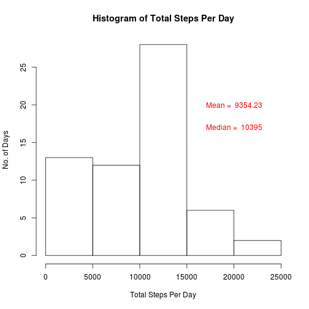
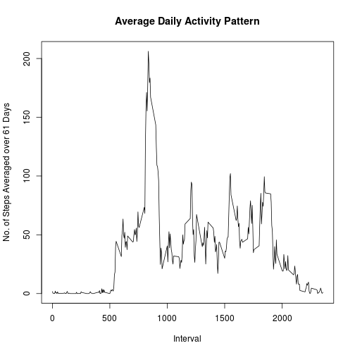
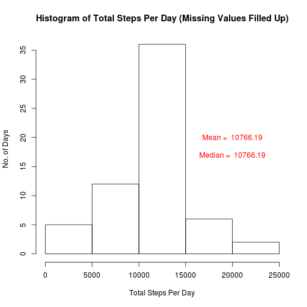
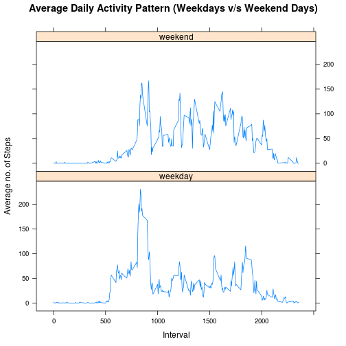

Reproducible Research Assignment 2
==================================
Activity Monitoring
-------------------


```r
library(lattice)
```

# Introduction
This is a report on the assignment as a part of Reproducible Research offered by JHU in coursera. This assignment makes use of activity monitoring data collected by a device in 5 minute intervals during a day. 

# Data
The data was collected over two months from an individual from October through November, 2012.

### Variables in the data

1. steps: Number of steps taking in a 5-minute interval (missing values are coded as NA)

2. date: The date on which the measurement was taken in YYYY-MM-DD format

3. interval: Identifier for the 5-minute interval in which measurement was taken

The dataset is stored in a comma-separated-value (CSV) file and there are a total of 17,568 observations in this dataset.

# Loading and Preprocessing the Data
The first step is loading the data. This done by the following code and the data will be available in activityData.

```r
activityData <- read.csv("activity.csv",colClasses="character",header=TRUE)
head(activityData)
```

```
##   steps       date interval
## 1  <NA> 2012-10-01        0
## 2  <NA> 2012-10-01        5
## 3  <NA> 2012-10-01       10
## 4  <NA> 2012-10-01       15
## 5  <NA> 2012-10-01       20
## 6  <NA> 2012-10-01       25
```
A preprocess step is to change the classes of the columns in the data appropriately.

```r
activityData$steps <- as.numeric(activityData$steps)
activityData$date <- as.Date(activityData$date,format="%Y-%m-%d")
activityData$interval <- as.numeric(activityData$interval)
lapply(activityData,class)
```

```
## $steps
## [1] "numeric"
## 
## $date
## [1] "Date"
## 
## $interval
## [1] "numeric"
```
# Mean Total Number of Steps Taken Per Day
To find the mean total number of steps taken per day, we first find out the total number of steps taken on each day in the data.

```r
totalStepsPerDay <- tapply(activityData$steps,activityData$date,sum,na.rm=TRUE)
head(totalStepsPerDay)
```

```
## 2012-10-01 2012-10-02 2012-10-03 2012-10-04 2012-10-05 2012-10-06 
##          0        126      11352      12116      13294      15420
```

Next, we compute the mean and median of the total steps per day and also plot the histogram.
The mean and median are reported on the histogram figure.

```r
meanTotalStepsPerDay <- mean(totalStepsPerDay)
medianTotalStepsPerDay <- median(totalStepsPerDay)
hist(totalStepsPerDay,breaks = 5,xlab = "Total Steps Per Day",ylab="No. of Days",main = "Histogram of Total Steps Per Day")
text(x=20000,y=20,labels = paste("Mean = ",round(meanTotalStepsPerDay,2)),col = "red")
text(x=20000,y=17,labels = paste("Median = ",round(medianTotalStepsPerDay,2)),col="red")
```

 

# Average Daily Activity Pattern
In this section, we compute the average daily steps taken for every 5 minute interval over the 61 days days recorderd.


```r
avStepsPer5min <- tapply(activityData$steps,activityData$interval,mean,na.rm=TRUE)
plot(names(avStepsPer5min),avStepsPer5min,main="Average Daily Activity Pattern",xlab="Interval",ylab="No. of Steps Averaged over 61 Days",type="l")
```

 

The 5-minute interval that contains maximum number of steps is computed below.

```r
maxStepInterval <- as.numeric(names(which(avStepsPer5min==max(avStepsPer5min))))
print(maxStepInterval) # 5-minutes interval index to the maximum step time
```

```
## [1] 835
```

```r
print(paste0(as.character(maxStepInterval %/% 100), ":", as.character(maxStepInterval%%100))) # Time in hours when maximum steps was recorded
```

```
## [1] "8:35"
```
The maximum average number of steps is taken at the 5-minutes interval = 835  (i.e.,  at 8:35 A. M. hours).

The maximum average number of steps is computed below.


```r
avStepsPer5min[as.character(maxStepInterval)]
```

```
##      835 
## 206.1698
```

# Imputing Missing Values
The total number of missing values in the data set is computed and displayed below.

```r
good <- complete.cases(activityData)
length(activityData$steps[!good])
```

```
## [1] 2304
```
Next, we fill in the missing values and create a new data set. In the following, the missing values are filled up by the corresponding average 5-minute steps.

```r
activityDataMissFil <- activityData
activityDataMissFil$steps[!good] <- avStepsPer5min[as.character(activityData$interval[!good])]
sum(is.na(activityDataMissFil$steps)) # Compute the number of missing values in the new data
```

```
## [1] 0
```
Below, we plot the histogram of the total steps taken from the new data in which missing values are filled up. The mean and median are reported on the histogram figure.

```r
totalStepsPerDay2 <- tapply(activityDataMissFil$steps,activityDataMissFil$date,sum)
meanTotalStepsPerDay2 <- mean(totalStepsPerDay2)
medianTotalStepsPerDay2 <- median(totalStepsPerDay2)
hist(totalStepsPerDay2,breaks = 5,xlab = "Total Steps Per Day",ylab="No. of Days",main = "Histogram of Total Steps Per Day (Missing Values Filled Up)")
text(x=20000,y=20,labels = paste("Mean = ",round(meanTotalStepsPerDay2,2)),col = "red")
text(x=20000,y=17,labels = paste("Median = ",round(medianTotalStepsPerDay2,2)),col="red")
```

 

The mean and median of the data with missing values filled up are different from the mean and median of the original data. Especially, the mean and median of the former are larger than the mean and median of the latter. In the data with missing values filled up, the mean and median are the same.

# Differences in Activity Patterns Between Weekdays and Weekends
In this section, differences in the activity pattern between Weekdays and Weekends are computed.

First, we create a factor variable in the dataset indicating weekdays and weekends.

```r
activityDataMissFil$day <- NA
activityDataMissFil$day[weekdays(activityDataMissFil$date)=="Saturday" | weekdays(activityDataMissFil$date)=="Sunday"] = "weekend"
activityDataMissFil$day[weekdays(activityDataMissFil$date)!="Saturday" & weekdays(activityDataMissFil$date)!="Sunday"] = "weekday"
```

Now plot the average number of steps taken every five minutes, averaged across all the weekdays and all weekends separately.


```r
avStepsPer5minMissFilWDay <- tapply(activityDataMissFil$steps[activityDataMissFil$day=="weekday"],activityDataMissFil$interval[activityDataMissFil$day=="weekday"],mean)

avStepsPer5minMissFilWEnd <- tapply(activityDataMissFil$steps[activityDataMissFil$day=="weekend"],activityDataMissFil$interval[activityDataMissFil$day=="weekend"],mean)

avStepsPer5minMissFil <- data.frame(avg_steps=c(avStepsPer5minMissFilWDay,avStepsPer5minMissFilWEnd), weekday=factor(c(rep("weekday",length(avStepsPer5minMissFilWDay)),rep("weekend",length(avStepsPer5minMissFilWEnd)))))

interval=as.numeric(row.names(avStepsPer5minMissFilWDay))

xyplot(avStepsPer5minMissFil$avg_steps ~ c(interval,interval)| avStepsPer5minMissFil$weekday ,layout = c(1,2),type="l",xlab="Interval",ylab="Average no. of Steps",main="Average Daily Activity Pattern (Weekdays v/s Weekend Days)")
```

 

By looking at the above plots, we can find the following differences between the activity patterns of weekdays and weekend:

1. On a weekday, on an average, the subject becomes active earlier (by 6:00 AM approx) than on a weekend (by 8:00 AM approx).

2. We can compute the total steps the subject takes on an average on a weekday and a weekend day:


```r
tapply(avStepsPer5minMissFil$avg_steps,avStepsPer5minMissFil$weekday,sum)
```

```
##  weekday  weekend 
## 10255.85 12201.52
```
So, on an average, the subject is more active throughout the weekend days than weekdays. The subject takes nearly 2000 steps more on a weekend day when compared to a weekday.

